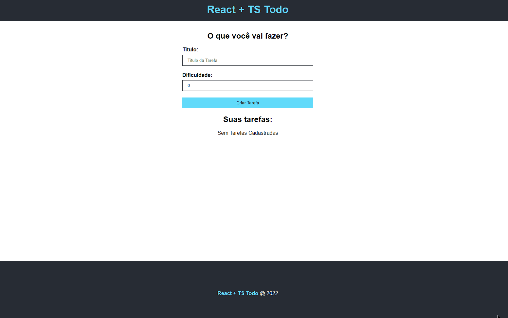

# TO DO list created using React.js and Typescript

This is a web app that can register tasks and its difficulty, update it and delete it.

All resources were made using React.js standard techniques like module components, CSS modules. It was also used Typescript to filter and validate functions and variables behaviours, using TS tools like interfaces, custom types (as union types or regular new types), generics, react events etc

# How to run it on your PC

<ol>
    <li>You can always use this link right <a href="https://Graben-el.github.io/TODO-List-React.TSX" target='_blank'>here</a> to access in your own browser easily
    <li>Or you can download this repository in your own PC
       <ul>
           <li>Run the "npm install" command inside the project directory, to install all dependencies needed;
           <li>Run the "npm start" command to run the project locally.
       </ul>
</ul>